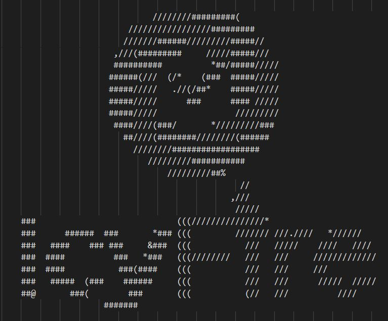

<p align="center">
    <a href="https://www.icy-fire.com/"></a>
    <h3>IcyFire server</h3>
</p>

<p align="center">
    Digital marketing runs on time with IcyFire.
    <br />
    <a href="https://github.com/neil-rutherford/icyfire-server"><strong>Explore the docs »</strong></a>
    <br />
    <br />
    <a href="https://github.com/neil-rutherford/icyfire-server/issues">Report bug</a>
        ·
    <a href="https://github.com/neil-rutherford/icyfire-server/issues">Request feature</a>
</p>

## Table of contents

* [About the project](#about-the-project)
  * [Built with](#built-with)
* [Getting started](#getting-started)
  * [Prerequisites](#prerequisites)
  * [Installation](#installation)
* [Usage](#usage)
* [Roadmap](#roadmap)
* [Contributing](#contributing)
* [License](#license)
* [Contact](#contact)

## About the project

This is the server code behind IcyFire Social. It sends periodic API calls to the [IcyFire website](https://github.com/neil-rutherford/icyfire-website), retrieves post and authentication information, and uses that to publish posts to social media. IcyFire Social is a social media queuing tool that aims to make digital marketing easier for small businesses, automate content publishing schedules, facilitate teamwork while employees are working from home, and open doors to outsourcing marketing work. IcyFire Social offers social media integrations for Facebook, Twitter, Tumblr, and Reddit via their respective APIs. The website serves as a input collection and data storage tool; external servers manage the timing and publishing.

This documentation is designed for Linux-based systems.

## Built with

* [Requests](https://requests.readthedocs.io/en/master/)
* [Pandas](https://pandas.pydata.org/)
* [Cryptography](https://cryptography.io/en/latest/)
* [Facebook SDK](https://facebook-sdk.readthedocs.io/en/latest/)
* [Python Twitter](https://github.com/bear/python-twitter)
* [Tweepy](https://www.tweepy.org/)
* [PyTumblr](https://github.com/tumblr/pytumblr)
* [PRAW](https://praw.readthedocs.io/en/latest/)
* [Dropbox](https://www.dropbox.com/developers/documentation/python#documentation)

## Getting started

You are free to run this locally on your own system, but please note that you will be unable to interact with the live IcyFire API without valid authentication tokens. To test, you can download the source code for the [IcyFire website](https://github.com/neil-rutherford/icyfire-website), change the accepted auth tokens there, and then play around with it. With that in mind, let's begin.

### Installation

In the terminal, execute the following commands:

```sh
# Clone the Github repository
git clone https://github.com/neil-rutherford/icyfire-server.git

# Set up and activate the virtual environment
python3 -m venv venv
source venv/bin/activate

# Install all dependencies
python3 -m pip install -r requirements.txt

# Set environmental variables
export SERVER_ID=<server_id>
export DROPBOX_ACCESS_KEY=<dropbox_access_key>
export READ_TOKEN=<read_token>
export DELETE_TOKEN=<delete_token>
export CRED_TOKEN=<cred_token>
export SECURITY_TOKEN=<security_token>
export SECRET_KEY=<secret_key>
export SALT=<salt>

# Make the file executable and run it
chmod +x main.py
./main.py
```

## Usage

The file is designed to be run indefinitely on a Linux-based server. On startup, you should see the IcyFire logo, as well as something that looks like this:

```sh
Initializing Server 1...
Lower bound: 1
Upper bound: 10800
Generated reference table: (3,10800)
UTC time now: Monday, August 10, 2020 00:01
Starting at timeslot 2
Running...
```

The script is designed to be very verbose, so you should be able to see its progress in stdout, like so:

```sh
Querying timeslot 2:
    Downloading multimedia...
    Posting Facebook image...
    Deleting post from queue...
    Deleting multimedia...
    Done.
Sleeping for 60 seconds...
Querying timeslot 3:
    INFO: Timeslot not assigned. This is fine.
Sleeping for 60 seconds...
Querying timeslot 4:
    Posting Twitter short text...
    Done.
Sleeping for 60 seconds...
```

## Roadmap

See the [open issues](https://github.com/neil-rutherford/icyfire-server/issues) for a list of features and known issues curated by the open-source community.

**TO-DO**: Find a way to automatically deploy new code using Github webhooks.

## Contributing

Contributions are what make the open source community such an amazing place to be learn, inspire, and create. Any contributions you make are **greatly appreciated**.

1. Fork the Project
2. Create your Feature Branch (`git checkout -b feature/AmazingFeature`)
3. Commit your Changes (`git commit -m 'Add some AmazingFeature'`)
4. Push to the Branch (`git push origin feature/AmazingFeature`)
5. Open a Pull Request

## License

Distributed under the MIT License. See `LICENSE` for more information.

## Contact

Neil Rutherford - [@neilbolyard](https://twitter.com/neilbolyard) - neilrutherford@icy-fire.com

IcyFire Technologies - [@IcyFireTech](https://twitter.com/IcyFireTech) - support@icy-fire.com